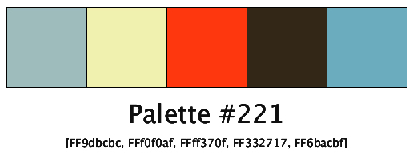
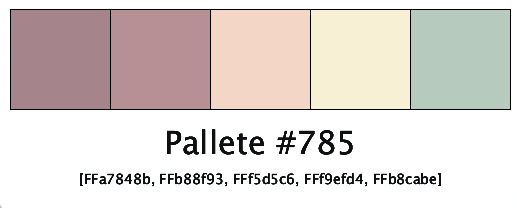
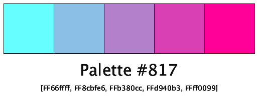

# color palette

## Description

This code is a utility to pull out random color palettes. This function is planned to be used in future projects and this is the program is the base for that.

### Disclosure

Color palettes were pulled from [https://github.com/Jam3/nice-color-palettes](https://github.com/Jam3/nice-color-palettes) and are under an MIT license. 

## Challenges

Py.Processing only has a limited way of importing data into a program. For example, `with open('data.txt') as f:` is not valid. The only way available to load in the `json` was through the processing method `loadStrings()`. This meant that I had to parse and convert the string value of the lists to actual lists.

---
## Examples

